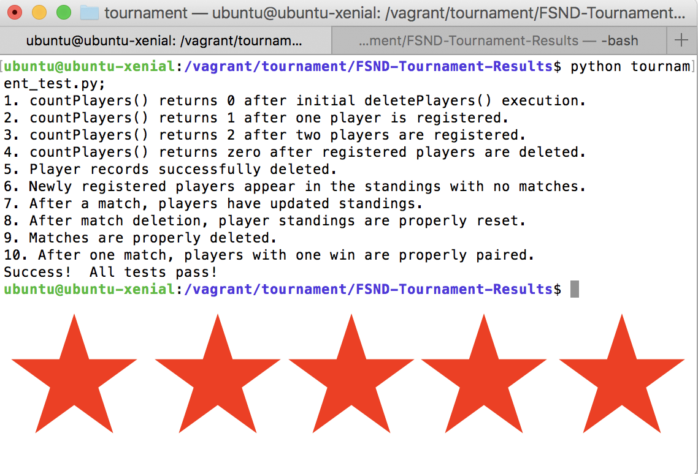

# Tournament Results 

## Project 4 Overview

The objective of this project was to create a database of a tournamnet using the SWISS-Paring system for pairing up players in each round, whereas players are not eliminated, and each player is paired with another player with the same number of wins as possible. 

For more information on the Swiss-Pairing system [click here](https://en.wikipedia.org/wiki/Swiss-system_tournament)

 The project consisted of two parts: defining the database schema(SQL table definitions), and writing the code that will use it in tournament.py using Python. 

___

## To Set up and Run

### Locally 

* [Clone or download this repository](https://github.com/eddiebrunson/FSND-Tournament-Results.git)
* Ensure you have or download Python [Download Python here](https://www.python.org/downloads/)
* Ensure you have or download both [Vagrant]((http://www.vagrantup.com/downloads.html) and [Virtual Box](https://www.virtualbox.org/wiki/Downloads) onto your computer.

1. Load the Virtual Machine:

* Change directory to the Vagrant project by entering `cd project/vagrant` into the command line
* To start Vagrant (power up your virtual machine) enter `vagrant up` into the command line 
* Log into the virtual machine by entering `vagrant ssh` into the command line 
* Enter `cd /vagrant/tournament` to get inside the project directory 

2. Create and connect to the database"

* To start PostgreSQL enter `psql`
* To see the tables and views enter `\i tournament.sql;`

3. To test the implementation of the functions in tournament.py;:

* Exit PostgreSQL by using this command `/q`
* Run the test client program by using this command `python tournament_test.py;`

___

## Screenshots

### tournament_test.py passing

  

---

## Sources

* Udacity Discussion Board
* [Pep8 Python Style Guide](https://www.python.org/dev/peps/pep-0008/)
* [Udacity's Intro to Relational Databases](https://www.udacity.com/course/intro-to-relational-databases--ud197)
* [Tournaments Results: Getting Started Guide](https://docs.google.com/document/d/16IgOm4XprTaKxAa8w02y028oBECOoB1EI1ReddADEeY/pub?embedded=true)
* [PostgreSQL Documentation](https://www.postgresql.org/docs/9.6/static/index.html)
* [ImportError Troubleshooting](http://stackoverflow.com/questions/12906351/importerror-no-module-named-psycopg2)
* [Psycopg Documentation](http://initd.org/psycopg/docs/)

